# Flood-Mapping-Using-Satellite-Images
MSc Thesis - Data Science - UoP &amp; NCSR "Demokritos"

<h2> Download The Dataset </h2>

- <b>First Option:</b> 
    Visit the following link:  
    https://mlhub.earth/data/c2smsfloods_v1 (you need to create an account first)
  
- <b>Second Option:</b> 
  The dataset is available for access through Google Cloud Storage bucket at: gs://senfloods11/

  You can access the dataset bucket using the gsutil command line tool. If you would like to download the entire dataset (~14 GB) you can use gsutil       rsync to clone the bucket to a local directory. The -m flag is recommended to speed downloads. The -r flag will download sub-directories and folder       recursively. See the example below.

  <i> $ gsutil -m rsync -r gs://sen1floods11 /YOUR/LOCAL/DIRECTORY/HERE </i>

<h2> Dataset Information </h2>

The dataset used is named as <b>Sen1Floods11</b> and it is comprised with Sentinel 1 & 2 images with the corresponding ground truth masks. The dataset contains two main folders (<b>flood_events & perm_water</b>) as shown below:

  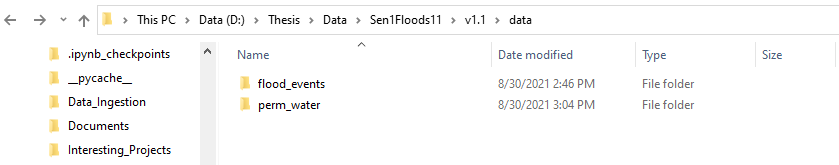

In this study we are only using the images included on the <b>Flood Events</b> folder and eliminate the permanent water images. The <b>flood_events</b> folder is further splitted into 2 subfolders as shown in the image below:

  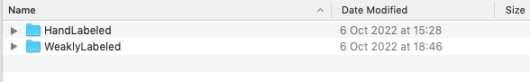

The <b> HandLabeled </b> subfolder is splitted into 5 subfolders from which we are not using the "JRCWaterHand".

  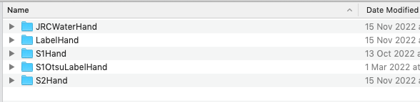

While the <b>WeaklyLabeled</b> folder is splitted into 3 from which we are not using the "S2IndexLabelWeak".

<h2> Flood Events </h2>

<h3> Hand Labeled </h3> 

 This subfolder contains one folder <b> S1Hand</b> which consists of sentinel 1 image patches with two polarization bands (VH & VV) and another one called <b> S2Hand </b> which includes Sentinel 2 image patches with all <b>13 spectral bands</b>. It should be noticed that not all bands share the same spatial resolution, thus if needed an extra processing (pansharpening) should be applied. The size of the patches is 512x512 within the coordinate system EPSG:4326 - WGS 84 - Geographic. The rest folders are the coresponding ground trouth mask, each one being created with a different method. The areas of study are parts of 12 countries as shown below: 

  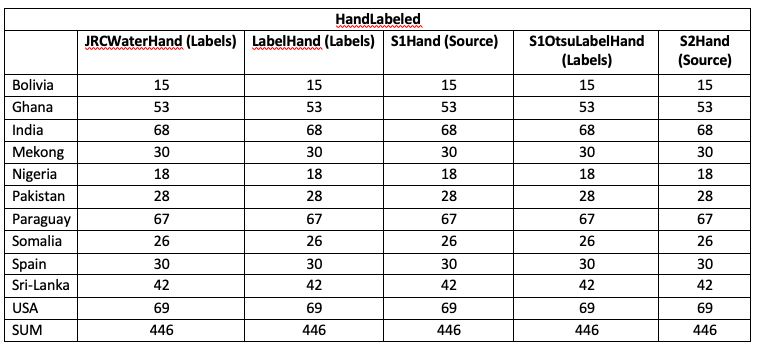

<h3> Weakly Labeled </h3>

  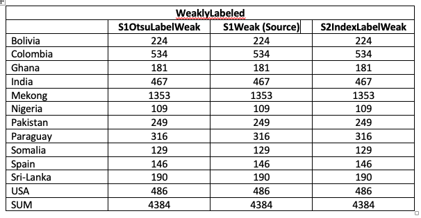

As can be seen the size of the Weakly labeled dataset is much larger than the hand labeled one.

<h2> Clean the Dataset - Pre Process </h2>
<h3> Hand Labeled </h3>

 After visualy checking the dataset with manually loading several image patches on a free and open Geographic Information System software called <a href="https://www.qgis.org/en/site/">QGIS</a>, we noticed that many images do not contain pixels with flood. Additionally we saw that many sentinel 2 images are majored covered with clouds which makes them useless. Bellow is an illustration of a sentinel 2 image tile blocked with clouds and the corresponding sentinel 1 tile and the respective label.

  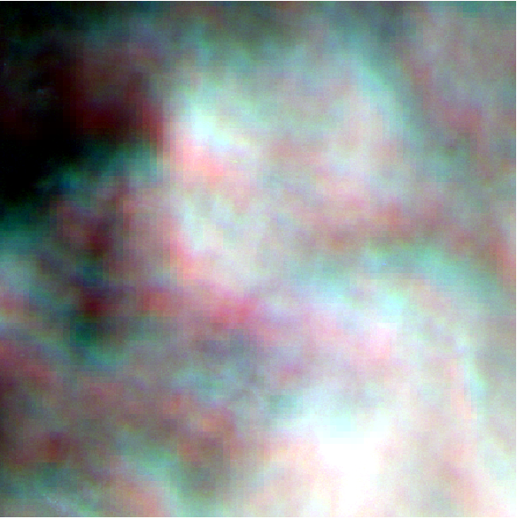
  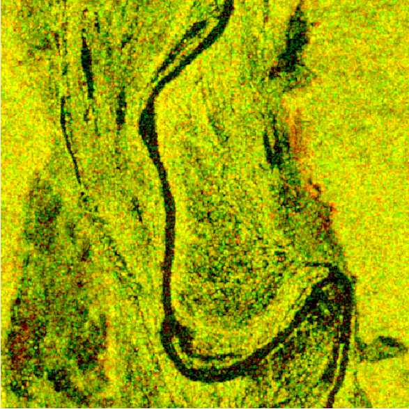 
  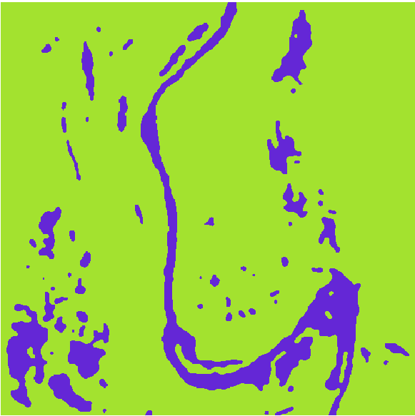

Additionaly some images appear to be acquired as "half" with this part of the image to be labeled as (-1).

  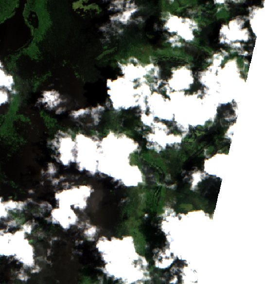
  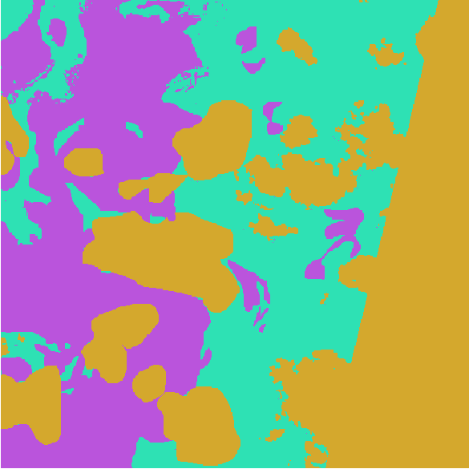 

Furthermote in order to create a set of sentinel 2 and sentinel 1 datasets which will be comparable we decided to remove the image tiles with at least one pixel labeled as (-1)...Since sentinel 1 labels do not have the label -1 (clouds). ...to be able to create a multi-modal dataset. It was decided that the labeling dataset JRCWaterHand will not be used since it doesn't cover floods but permanent waters.

The initial image tiles of 512x512 size were splited into patches of 128x128. So from each itinial image 16 patches were created. In a google colab environment it took 8 to 10 hours to finish.

After spliting the intial images, we resulted into 7136 128x128 image patches for S1Hand, S2Hand, LabelHand and S1OtsuLabelHand. From these we identified the patches with only (-1) label and deleted them. After this proccess we ended up with 6825 patches.

Bolivia new: 231
Ghana new: 650
India new: 1068
Mekong new: 479
Nigeria new: 282
Pakistan new: 417
Paraguay new: 1055
Somalia new: 414
Spain new: 478
Sri-Lanka new: 663
USA new: 1088

<h3> Weakly Labeled </h3>

 The initial total number of images were 4384. We split each image into 16 patches of a size 128x128 pixels, resulting in 70144 patches in ttoal. From these we remove the patches having at least one pixel labeled as (-1), patches were the number of flooded pixels were more than 50% than the background pixels and patches with with background pixels more than 50% of the flooded pixels, reuslting in a dataset comprised of 6835 patches. Since the number of patches were still very high and not easy to handle we kept only the first 50 patches from each geographic area, resulting in 600 patches in total. 

The link for the new dataset: https://uopel-my.sharepoint.com/:f:/g/personal/dit2025dsc_office365_uop_gr/EomiPN1R1GNMuYLDtHBQgaoBVZ1GBJ-Xfo8xGmuSfAh2Ug?e=wKLRmL

<h2> Experiments  </h2>
Experiments were splited into three parts, with each one based on a different semantic segmentation scheme. The first one is based on a Random Forest architecture and a set of hand crafted features, the second is based on the concept of transfer learning while the last on is based on a U-NET fully convolutional neural network. 

<h3>1. U-NET </h3>

U-Net is a convolutional neural network that was developed for biomedical image segmentation. The network is based on the <b>fully convolutional network</b> and its architecture was modified and extended to work with fewer training images and to yield more precise segmentations. The network consists of a contracting path (convolution) and an expansive path (deconvolution), which gives it the u-shaped architecture. The contracting path is a typical convolutional network that consists of repeated application of convolutions, each followed by a rectified linear unit (ReLU) and a max pooling operation. During the contraction, the spatial information is reduced while feature information is increased. The expansive pathway combines the feature and spatial information through a sequence of up-convolutions and concatenations with high-resolution features from the contracting path. [https://en.wikipedia.org/wiki/U-Net#cite_note-Shelhamer_2017-2]

  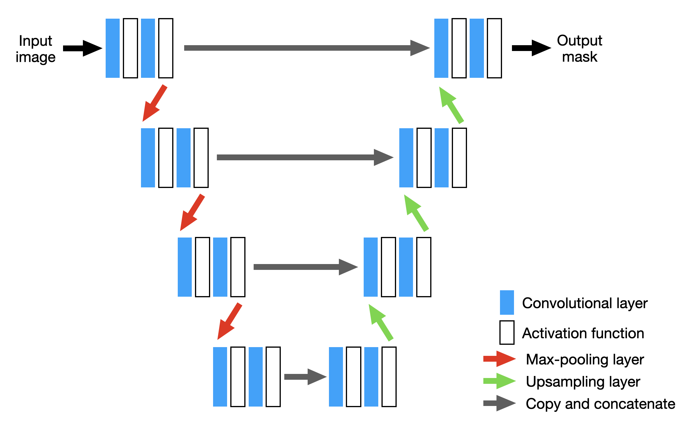

### Single-Modal - UNET
| Hand Labeled             |    |     |     |     |      |
| ------------------------ |--- | --- | --- | --- | ---- |
| Source & Labels          |IOU | Acc | Pre | F1  |Recall|
| S1Hand & S1OtsuLabelHand |0.89|0.94 |.    |.    |.     |
| S2Hand & LabelHand       |0.63|0.82 |.    |.    |.     |   

|Weakly Labeled           | --- | --- | --- | --- |------|
|-------------------------| --- | --- | --- | --- | ---- |
| Source & Labels         | IOU | Acc | Pre | F1  |Recall|
| S1Hand & S1OtsuLabelWeak|0.81 |0.87 |.    |.    |      |

|Weakly Supervised        |                 | --- | --- | --- | --- |------|
|-------------------------|---------------- |---  | --- | --- | --- |------|
| Trained On              |  Tested on      | IOU | Acc | Pre | F1  |Recall|
| S1Hand & S1OtsuLabelWeak| S1OtsuLabelHand |0.77 |0.86 |.    |.    |.     |
                   

### Multi-Modal - UNET

| Hand Labeled                        | --- | --- | --- | --- |------|
| ----------------------------------- | --- | --- | --- | --- | ---- | 
| Source & Labels                     | IOU | Acc | Pre | F1  |Recall|
| S1Hand - S2Hand & S1OtsuLabelHand   |0.72 |0.82 |.    |.    |.     |
| S1Hand - S2Hand & LabelHand         |0.67 |0.84 |.    |     |.     |

<h3> 2. Random Forest - Feature Engineering </h3>
Feature based segmentation using Random Forest

List of Hand Crafted Features:
  
- <b> Roberts Cross </b>  
- <b> Median Kernel 3x3</b>  
- <b> Variance Kernel 3x3</b>  
- <b> Normalized Difference Vegetation Index (NDVI) </b>  
- <b> Modified Normalized Difference Water Index (MNDWI) </b>  

### Single-Modal - RF
| Hand Labeled             |--- | --- | --- | --- |------|
| ------------------------ |--- | --- | --- | --- | ---- |
| Source & Labels          |IOU | Acc | Pre | F1  |Recall|
| S1Hand & S1OtsuLabelHand |0.79|89.00|88.75|88.44|88.14 |
| S2Hand & LabelHand       |0.87|93.11|93.11|93.11|93.11 |

|Weakly Labeled           | --- | --- | --- | --- |------|
|-------------------------| --- | --- | --- | --- | ---- |
| Source & Labels         | IOU | Acc | Pre | F1  |Recall|
| S1Weak & S1OtsuLabelWeak|0.81 |90.11|90.34|89.68|89.02 |

|Weakly Supervised        |                          | --- | --- | --- | --- |------|
|-------------------------|--------------------------|---  | --- | --- | --- |------|
| Trained On              |  Tested on               | IOU | Acc | Pre | F1  |Recall|
| S1Weak & S1OtsuLabelWeak| S1Hand + S1OtsuLabelHand | 0.77|87.95|91.51|86.72|82.40 |

Accuracy =  0.8795124761359944
IOU =  0.765536895862859
Precision =  0.9151527634132604
Recall =  0.824022546895149
F1 score =  0.8672001108067734
                   

### Multi-Modal - RF

| Hand Labeled                        | --- | --- | --- | --- |------|
| ----------------------------------- | --- | --- | --- | --- | ---- | 
| Source & Labels                     | IOU | Acc | Pre | F1  |Recall|
| S1Hand - S2Hand & S1OtsuLabelHand   |0.84 |91.57|91.77|91.09|90.42 |
| S1Hand - S2Hand & LabelHand         |0.87 |93.05|93.05|93.05|93.05 |

<h3> 3. Transfer Learning - VGG16 </h3>

A CNN can be divided into two main parts: Feature learning and classification.

Feature Learning

In this part, the main goal of the NN is to find patterns in the pixels of the images that can be useful to identify the targets of the classification. That happens in the convolution layers of the network that specializes in those patterns for the problem at hand.

Classification

Now we want to use those patterns to classify our images to their correct label. This part of the network does exactly that job, it uses the inputs from the previous layers to find the best class to your matched patterns in the new image.

### Single-Modal - Transfer Learning (R NIR SWIR, VV+VH +VH/VV)
| Hand Labeled             |--- | --- | --- | --- |------|
| ------------------------ |--- | --- | --- | --- | ---- |
| Source & Labels          |IOU | Acc | Pre | F1  |Recall|
| S1Hand & S1OtsuLabelHand |0.84|0.92 |.    |.    |.     |
| S2Hand & LabelHand       |0.47|0.65 |.    |.    |.     |   

|Weakly Labeled           | --- | --- | --- | --- |------|
|-------------------------| --- | --- | --- | --- | ---- |
| Source & Labels         | IOU | Acc | Pre | F1  |Recall|
| S1Hand & S1OtsuLabelWeak|0.86 |0.92 |.    |.    |      |

|Weakly Supervised        |                          | --- | --- | --- | --- |------|
|-------------------------|--------------------------|---  | --- | --- | --- |------|
| Trained On              |  Tested on               | IOU | Acc | Pre | F1  |Recall|
| S1Hand & S1OtsuLabelWeak| S1Hand + S1OtsuLabelHand |0.83 |0.91 |.    |.    |.     |
                   

### Multi-Modal - Transfer Learning

| Hand Labeled                        | --- | --- | --- | --- |------|
| ----------------------------------- | --- | --- | --- | --- | ---- | 
| Source & Labels                     | IOU | Acc | Pre | F1  |Recall|
| S1Hand - S2Hand & S1OtsuLabelHand   |.    |     |.    |.    |.     |
| S1Hand - S2Hand & LabelHand         |.    |.    |.    |.    |.     |

Reference: https://towardsdatascience.com/transfer-learning-with-vgg16-and-keras-50ea161580b4

<h2> Pre - Processing - Sentinel 1 </h2>

- Apply orbit file 
- GRD border noise removal
- Thermal noise removal
- Radiometric calibration
- Terrain correction (orthorectification)
  
